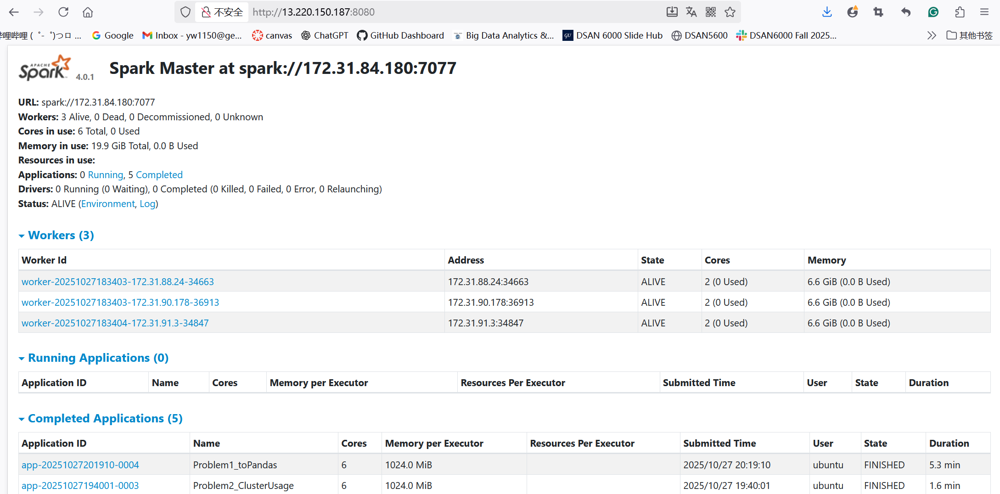

# Analysis Report

## Problem 1: Log Level Distribution

**Approach**
- Load log data from the S3 bucket
- Apply regular expressions to extract timestamps, log levels, and components
- The random 10-line sample is generated using orderBy(F.rand()).limit(10)
- Summary statistics are computed using Spark aggregations

**Key Finding**
- INFO messages dominated the logs, indicating stable and expected cluster operation.

---

## Problem 2: Cluster Usage Analysis

**Approach**
- Accurate cluster and application IDs were extracted from filenames using regular expressions
- Timeline data was generated by grouping and taking the minimum and maximum timestamps as start and end times
- Visualizations were created using seaborn

**Key Findings**  
- 6 unique clusters were identified with Average applications per cluster: 32.17
- Cluster 1485248649253 is the primary production cluster
- The duration distribution of jobs within the largest cluster is right-skewed

---

## Performance Analysis

On the AWS Spark cluster, Problem 1 completed in approximately 5.3 minutes, while Problem 2 finished in around 1.6 minutes. By contrast, the same logic on a small local sample dataset took only tens of seconds.

Given the full dataset’s scale and distributed overhead, the cluster execution was roughly 10-15 × faster than equivalent local processing on a single machine.

---

## Documentation

Screenshots from the Spark Web UI:  

---